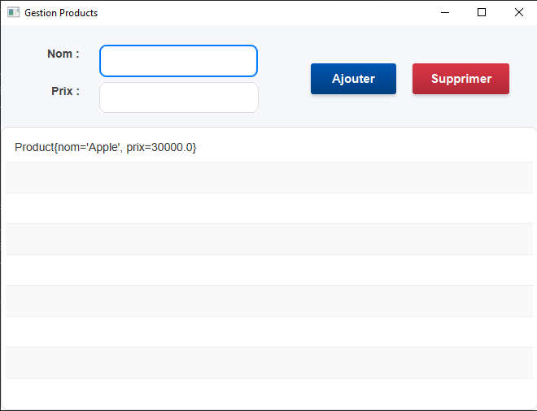
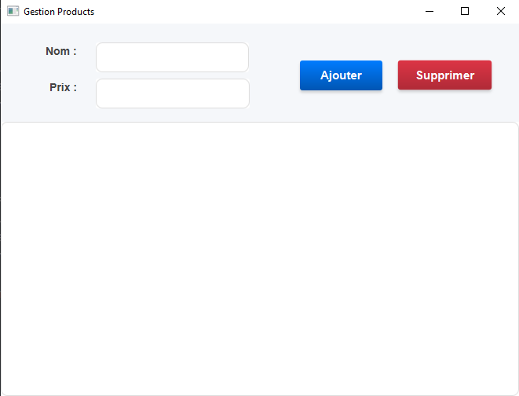

# Application JavaFX de Gestion de Produits

Ce projet illustre une application JavaFX simple pour la gestion de produits. Elle permet aux utilisateurs d'ajouter, de supprimer et de rechercher des produits, en les affichant dans une `ListView`.

**TP / Exercice : Création d'une application JavaFX de gestion de produits.**

## Objectifs

*   Comprendre et appliquer le pattern MVC (Model-View-Controller).
*   Créer une interface utilisateur JavaFX avec des formulaires, des listes et des boutons.
*   Gérer les événements utilisateur (ajout, suppression).
*   Utiliser des `ObservableList` pour la gestion de données en JavaFX.
*   Appliquer des styles CSS à une application JavaFX.

## Structure du Projet

L'application est structurée selon le pattern MVC :

*   **Modèle :** `Product.java` - Représente un produit avec des attributs `nom` et `prix`.
*   **Vue :** `products-view.fxml` - Définit la disposition de l'interface utilisateur.
*   **Contrôleur :** `ProductControler.java` - Gère les interactions de l'utilisateur et met à jour les données.
*   **Application :** `App.java` - Point d'entrée de l'application.
*   **Style :** `style.css` - Fournit le style visuel de l'application.

## Composants Clés (Solution)

*   **Modèle Produit (`Product.java`):** Définit la structure d'un produit. Comprend les attributs nom et prix, ainsi que les getters, setters et une méthode `toString()`.

    ```java
    public class Product {
        private String nom;
        private double prix;
        // ... (getters, setters, constructeur, toString)
    }
    ```

*   **Vue FXML (`products-view.fxml`):** Définit l'interface utilisateur à l'aide du balisage XML de JavaFX. Comprend des `TextField` pour la saisie, des `Button` pour les actions et une `ListView` pour l'affichage des produits. Il définit le formulaire de produit, le champ de recherche et la `ListView`.

    ```xml
    <BorderPane prefHeight="474.0" prefWidth="660.0" stylesheets="@style.css" xmlns="http://javafx.com/javafx/23.0.1" xmlns:fx="http://javafx.com/fxml/1" fx:controller="ma.enset.gestionproductsjavafx.ProductControler">
        <!-- Éléments d'interface utilisateur définis ici -->
        <TextField fx:id="nom_field" />
        <TextField fx:id="prix_field" />
        <Button fx:id="btn_add" onAction="#AddProduct" />
        <ListView fx:id="listview" />
    </BorderPane>
    ```

*   **Contrôleur (`ProductControler.java`):** Gère les actions de l'utilisateur, met à jour les données et gère les composants de l'interface utilisateur définis dans le fichier FXML. Il définit la logique d'ajout, de suppression et de recherche de produits.

    ```java
    public class ProductControler implements Initializable {
        @FXML private TextField nom_field;
        @FXML private ListView<Product> listview;

        public void AddProduct() { 
        if (!prix_field.getText().trim().isEmpty() || !nom_field.getText().trim().isEmpty()){
            try {
                double prix = Double.parseDouble(prix_field.getText());
                String name = nom_field.getText();
                Product pr1 = new Product(name, prix);
                data.add(pr1);
                prix_field.setText("");
                nom_field.setText("");
            } catch (NumberFormatException e) {
                Alert alert = new Alert(Alert.AlertType.ERROR);
                alert.setContentText("The prix is not valid!");
                alert.show();
            }
        }else{
            Alert alert = new Alert(Alert.AlertType.WARNING);
            alert.setContentText("Entrer les valeurs!");
            alert.show();
        }}
    
        public void DeleteProduct() {
        int index = listview.getSelectionModel().getSelectedIndex();
        if (index == -1){
            Alert alert=new Alert(Alert.AlertType.ERROR);
            alert.setContentText("Veuillez séléctionner un produit !!!");
            alert.show();
        }else{
            data.remove(index);
        } }

        @Override
        public void initialize(URL url, ResourceBundle resourceBundle) { /* Initialiser ListView */ }
    }
    ```

## Tester l'Application (Instructions de Validation)

Pour tester l'application, suivez ces étapes :

1.  **Ajouter des Produits :** Entrez un nom et un prix dans les champs fournis et cliquez sur "Ajouter". Vérifiez que le produit est ajouté à la `ListView`.

    

2.  **Supprimer des Produits :** Sélectionnez un produit dans la `ListView` et cliquez sur "Supprimer". Vérifiez que le produit est retiré de la liste.

    